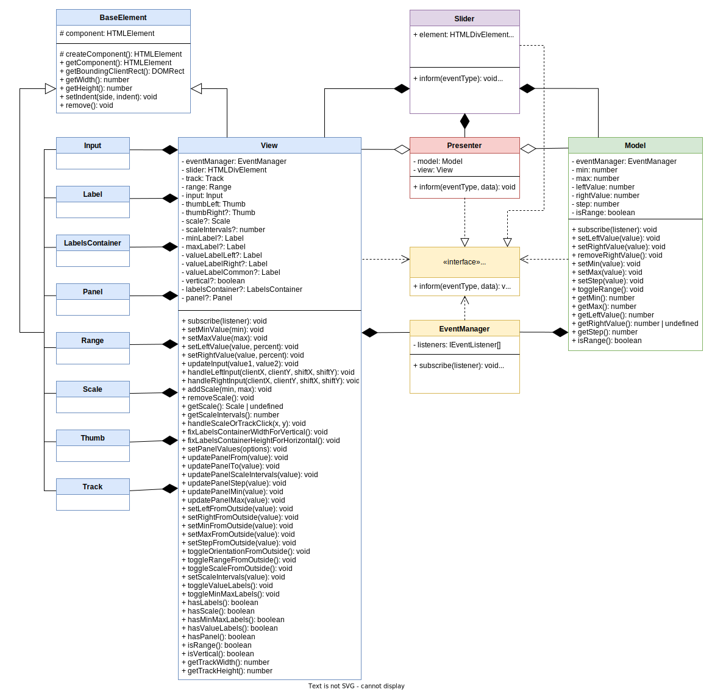
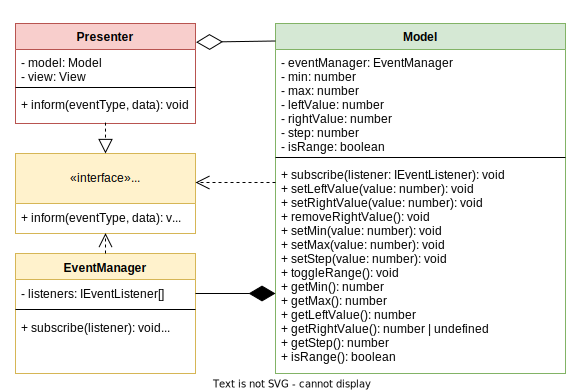
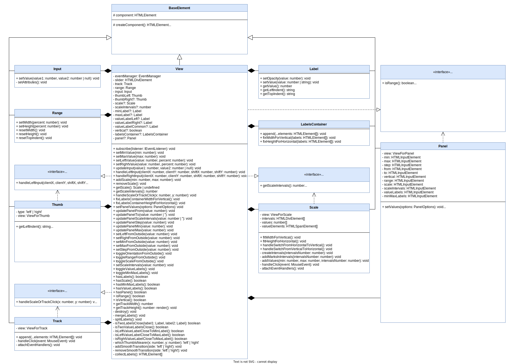
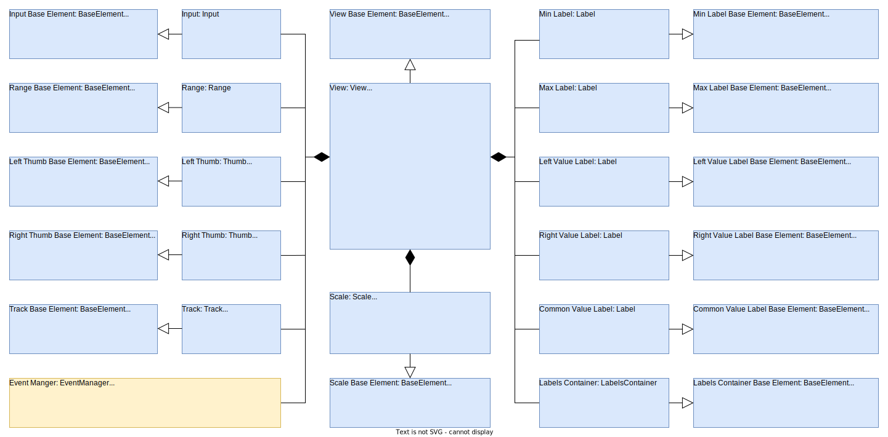
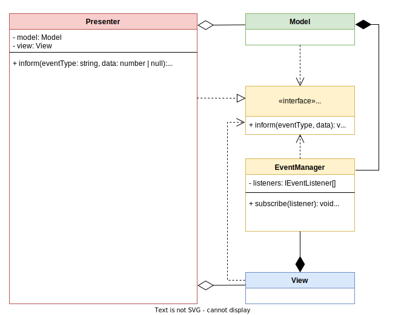
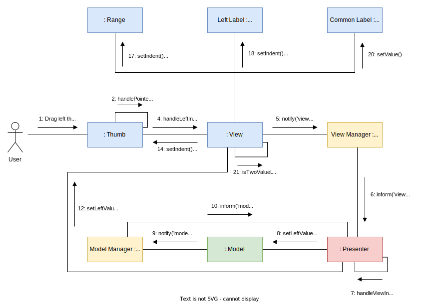
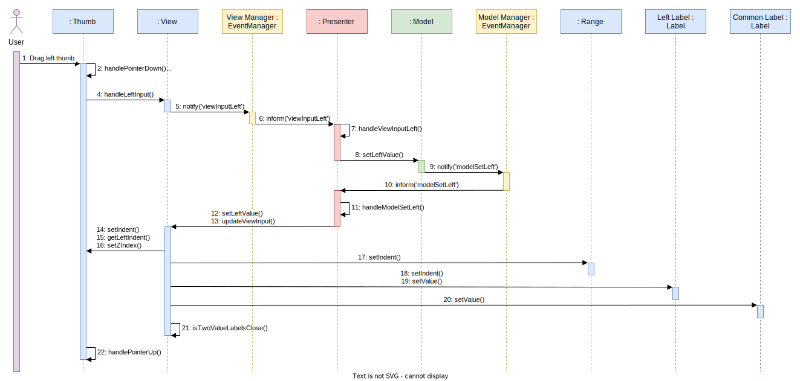

# RangeSlider
Easy to use, flexible and responsive range slider.
[Demo](https://olga-smart.github.io/test/demo/demo.html) 


## Table of Contents
1. [Description](#description)
2. [Key Features](#key-features)
3. [Dependencies](#dependencies)
4. [Usage](#usage)
5. [Initialization](#initialization)
6. [Settings](#settings)
7. [Public Methods](#public-methods)
8. [Events](#events)
9. [Under the Hood](#under-the-hood)

## Description
* RangeSlider — cool, comfortable, responsive and easily customizable range slider
* Supports events and public methods, has flexible settings, can be completely altered with CSS
* Supports touch-devices

## Key Features
* Any number of sliders at one page without conflicts and big performance problems
* Two slider types: single (1 slider) and double (2 sliders)
* Support of negative and fractional values
* Ability to set custom step
* Ability to disable UI elements (min and max labels, current value label, scale)
* Slider writes its value right into input value field. This makes it easy to use in any html form
* Any slider value can be set through data-attribute (eg. data-min="10")
* Slider supports external methods to control it after creation

## Dependencies
* [jQuery 1.11.x+](https://jquery.com/)

## Usage
Add the following libraries to the page:
* jQuery
* rangeSlider.js

Add the following stylesheets to the page:
* rangeSlider.css

## Initialization
1. Add div with classes 'range-slider' and 'js-range-slider' to the page:
```html
<div class="range-slider js-range-slider"></div>
```
2. Call rangeSlider on the element:
```javascript
$('.js-range-slider').rangeSlider();
```

Parameters can be passed as an object:
```javascript
$('.js-range-slider').rangeSlider({
  min: 0,
  max: 100,
  range: true,
  leftValue: 25,
  rightValue: 75,
  step: 1,
  minMaxLabels: true,
  valueLabels: true,
  vertical: false,
  scale: true,
  scaleIntervals: 5,
  panel: false,
});
```

or using data-* attributes:
```html
<div class="range-slider js-range-slider"
  data-min="0"
  data-max="100"
  data-range="true"
  data-left-value="25"
  data-right-value="75"
  data-step="1"
  data-min-max-labels="true"
  data-value-labels="true"
  data-vertical="false"
  data-scale="true"
  data-scale-intervals="5"
  data-panel="false"
>
</div>
```

## Settings
| Option           | Data-Attr              | Defaults | Type    | Description          |
| ---              | ---                    | ---      | ---     | ---                  |
| `min`            | `data-min`             | `0`      | number  | Slider minimum value |
| `max`            | `data-max`             | `100`    | number  | Slider maximum value |
| `range`          | `data-range`           | `true`   | boolean | False for one handle, true for two handles |
| `leftValue`      | `data-left-value`      | `25`     | number  | Start position for left/bottom handle (or for single handle) |
| `rightValue`     | `data-right-value`     | `75`     | number  | Start position for right/top handle |
| `step`           | `data-step`            | `1`      | number  | Slider`s step. Always > 0. Could be fractional |
| `minMaxLabels`   | `data-min-max-labels`  | `true`   | boolean | Shows min and max labels |
| `valueLabels`    | `data-value-labels`    | `true`   | boolean | Shows from and to labels |
| `vertical`       | `data-vertical`        | `false`   | boolean | Makes slider vertical |
| `scale`          | `data-scale`           | `false`  | boolean | Shows scale |
| `scaleIntervals` | `data-scale-intervals` | `5`      | number  | Number of scale intervals |
| `panel`          | `data-panel`           | `false`  | boolean | Enables panel for interactive slider settings |

## Public Methods

To use public methods, at first you must save slider instance to variable:

```javascript
// Launch plugin
$('.js-range-slider').rangeSlider();

// Saving it's instance to variable
const slider = $('.js-range-slider').data('rangeSlider');

// Fire public method
slider.setLeftValue(50);

// Method calls can be chained
slider.setLeftValue(50).setRightValue(80).setStep(10);
```

There are 3 public methods, whose names speak for themselves:
``` javascript
// setLeftValue
slider.setLeftValue(50);

// setRightValue
slider.setRightValue(80);

// setStep
slider.setStep(10);
```

## Events

You may add your own handler for slider values change event:
``` javascript
// Launch plugin
$('.js-range-slider').rangeSlider();

// Saving it's instance to variable
const slider = $('.js-range-slider').data('rangeSlider');

// Write your event handler
slider.onChange = (leftValue, rightValue) => {
  // your code to be executed when the slider values ​​change
};
```

Also you may use only 1 parameter:
``` javascript
slider.onChange = (leftValue) => {
  // your code to be executed when the slider values ​​change
};
``` 

Or even without parameters:
``` javascript
slider.onChange = () => {
  // your code to be executed when the slider values ​​change
};
```

You may easily remove this handler later:
``` javascript
delete slider.onChange;
```

## Under the Hood

### Architecture

Plugin was created using the MVP pattern with passive View.



*Class diagram: general perspective*

#### Model

Model knows nothing about View and Presenter and is managed by Presenter, which calls the necessary methods. Any class that implements the IEventListener interface can subscribe to Model events.



*Class diagram: model perspective*

#### View

View knows nothing about Model and Presenter and is managed by Presenter, which calls the necessary methods. It contains display related logic and reacts to user actions. Any class that implements the IEventListener interface can subscribe to View events.

Slider components are implemented by separate classes - subViews, which are connected with the main View class using composition. Only View class has access to these subViews. View redirects calls to subViews' methods. For example, Presenter tells View to set left value and View tells its subViews to do necessary actions: thumb will change its position, range will change its length, label will change its textContent etc. 

Some subViews are aware of the View existence. These are the subViews that cannot handle their events by alone: Thumb, Track, Scale, Panel. Other subViews don't know about the View existence.

Panel is a special kind of subView, because it is only needed at the development stage so that the developer can experiment with the slider settings.



*Class diagram: view perspective (sorry, you have to scale the picture)*




*Object diagram: view perspective*

#### Presenter

Presenter is associated with Model and View by Observer pattern and acts as the middleman between them. It has only 1 public method - inform(eventType, data). That is, all we can do with the Presenter is to notify it that some event happened. And then the Presenter decides what to do with this information.

Presenter subscribes to Model and View events at the time of slider initialization.



*Class diagram: presenter perspective*

When user moves the slider, a whole chain of events is triggered, which is shown in the 2 diagrams below. We omitted such optional objects as min/max labels and panel to make information easier to understand.



*Communication diagram*



*Sequence diagram*

#### Wrapper

All 3 layers are combined in Slider class, which you can see on [general class diagram](#under-the-hood). Each slider instance on the page is an instance of this class.

Slider instances are created inside a special wrapper function, which is written in jQuery. The passed parameters are validated inside this wrapper function. Also the wrapper contains an object with default values.

### Development

#### Node

The project is compatible with Node versions from 10 to 16.

#### Installing Dependencies

To install dependencies, run the command:
``` bash
npm i
```

#### Starting the Development Server

To start the development server, run the command:
``` bash
npm start
```

#### Making the Build

To run a production build, run the command:
``` bash
npm run build
```

#### Testing

Test run command:
``` bash
npm run test
```

[Jest](https://jestjs.io/) and [Puppeteer](https://pptr.dev/) were used for tests. The test run command should only be run after the project has been built, because the Puppeteer tests need the pages generated by the build.

Test coverage:


#### Deploy

To update the [demo](https://olga-smart.github.io/FSD_4/demo/demo.html), run the command:
``` bash
npm run deploy
```

You need to have dist folder with generated files to run this command. So if you don't have dist folder [make a build](#making-the-build) before. 

#### Commit

You need to have dist folder with generated files to make commit because tests run on every commit. So if you don't have dist folder [make a build](#making-the-build) before.

 